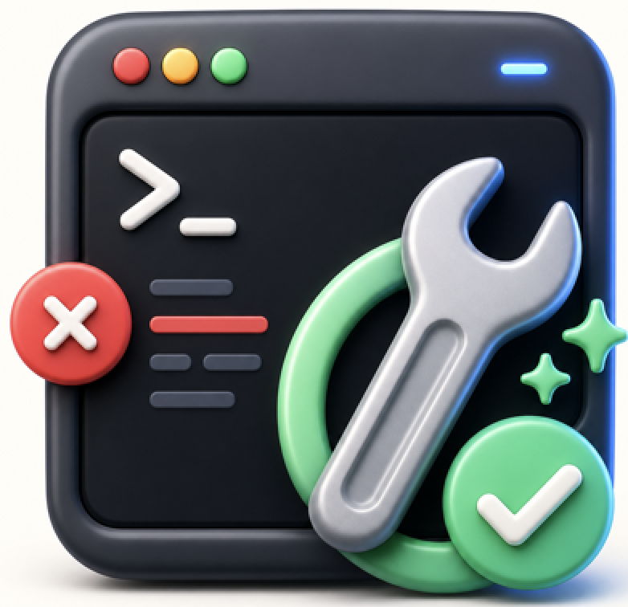
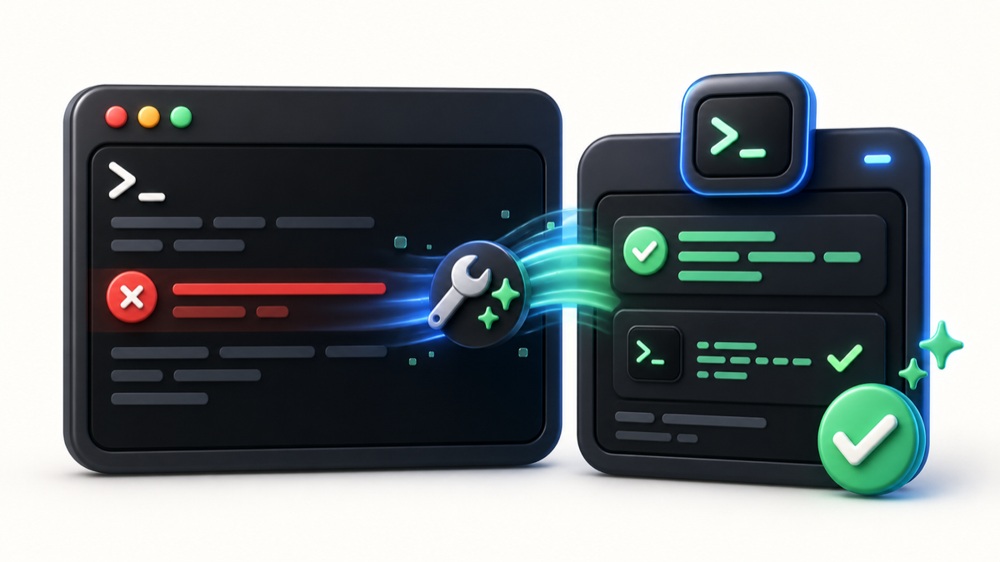
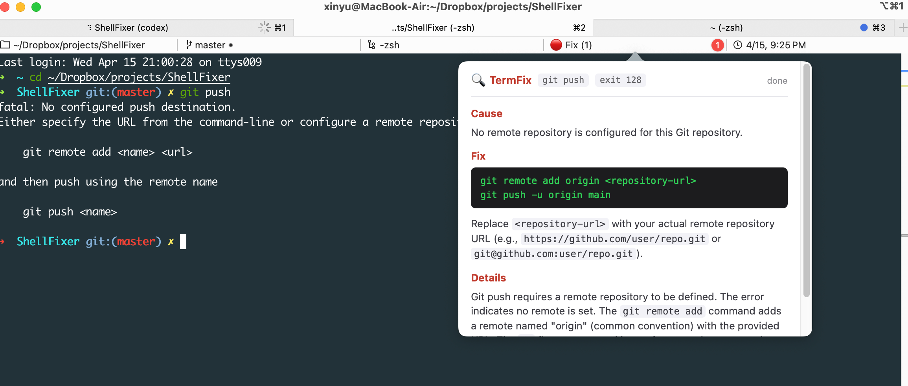
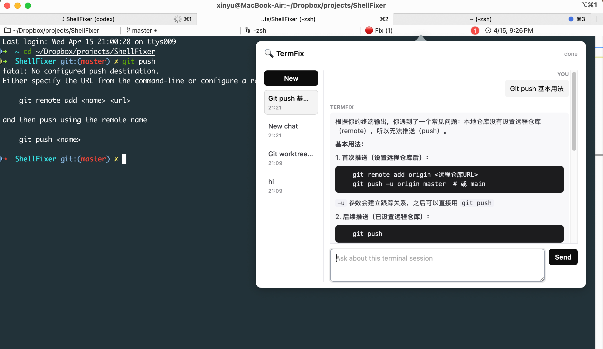

<div align="center">
  <h1>
    
    TermFix
  </h1>
  <p><strong>把失败的终端命令，变成可执行的修复建议。</strong></p>
  <p>
    iTerm2 状态栏插件。捕获非零退出命令，读取当前 session 的最近上下文，
    调用 OpenAI 兼容模型，并在弹窗里流式展示原因、修复命令和解释。
  </p>
  <p>
    
    
    
    
    
  </p>
</div>



## Why TermFix

终端报错通常不是缺少答案，而是答案离出错现场太远。TermFix 把失败命令、退出码、当前目录、shell、系统信息和最近终端输出一起交给模型，让修复建议直接出现在 iTerm2 里。

- **只在你触发时分析**：命令失败后先记录，按 `Cmd+J` 或点击状态栏才调用模型。
- **贴着终端上下文回答**：模型能看到最近终端输出，不需要你复制一大段日志。
- **修复建议可复制、可复查**：弹窗关闭后结果保留，代码块带复制按钮。
- **不强绑供应商**：默认使用 DeepSeek，任何 OpenAI 兼容 `/chat/completions` API 都能接入。
- **不用额外 SDK**：HTTP 调用基于 Python 标准库，不需要安装 `openai` 包。

## Quick Start

前置条件：

| 依赖 | 要求 |
| --- | --- |
| iTerm2 | 3.4+，开启 Python API |
| Python | 3.8+，使用 iTerm2 脚本运行时或系统 Python |
| Shell Integration | 每个需要监控的 session 都要安装 |
| API Key | OpenAI 兼容服务商的 key，例如 DeepSeek |

1. 在 iTerm2 开启 Python API：
   **iTerm2 → Preferences → General → Magic → Enable Python API**

2. 安装 Shell Integration：
   **iTerm2 → Install Shell Integration**

3. 在项目根目录同步插件：
   ```bash
   ./setup.sh
   ```

4. 启动脚本：
   **iTerm2 → Scripts → AutoLaunch → termfix.py**

5. 加入状态栏：
   **Preferences → Profiles → Session → Configure Status Bar**，把 **TermFix** 拖到激活区域。

6. 配置模型：
   Control + 鼠标左键点击状态栏里的 TermFix，选择 **Configure**，填入 API Key。

配置完成后，状态栏会显示 `✅`。当某条命令失败时，它会变成 `🔴 Fix (1)`。

## Experience

失败命令被记录后，按 `Cmd+J` 或点击状态栏即可打开分析弹窗：



弹窗会流式刷新模型输出，通常包含：

- **Cause**：一句话说明根因
- **Fix**：可执行的 shell 命令或修改方向
- **Details**：为什么会失败，以及修复为什么有效

按 `Cmd+L` 可以打开手动提问弹窗。它会带上当前终端上下文，支持多轮追问、历史恢复和 `Shift+Enter` 换行：



## How It Works

```text
failed command
      │
      ▼
iTerm2 PromptMonitor captures command + exit code
      │
      ▼
TermFix collects recent terminal context
      │
      ▼
Cmd+J / status click manually starts analysis
      │
      ▼
OpenAI-compatible model streams Markdown into the popover
```

TermFix 不会自动执行修复命令。模型只生成建议，是否运行由你决定。

## Configuration

在状态栏组件的 **Configure** 里设置：

| Knob | 说明 | 默认值 |
| --- | --- | --- |
| **Base URL** | OpenAI 兼容接口地址 | `https://api.deepseek.com` |
| **API Key** | 服务商 API Key | 空，必填 |
| **Model** | 使用的模型 | `deepseek-chat` |
| **Context Lines** | 捕获最近多少行终端内容 | `50` |

补充说明：

- OpenAI 官方接口可以填 `https://api.openai.com` 或 `https://api.openai.com/v1`，TermFix 会自动补齐正确路径。
- 如果服务商要求完整 endpoint，也可以直接填到 `.../chat/completions`。
- API Key 只保存在 iTerm2 状态栏组件的 knob 配置里。

## Usage

运行一条会失败的命令：

```bash
git psuh
npm run buid
python script.py
```

状态栏会从：

```text
✅
```

变成：

```text
🔴 Fix (1)
```

常用操作：

| 操作 | 结果 |
| --- | --- |
| 点击 `🔴 Fix (n)` | 分析最近一条失败命令 |
| `Cmd+J` | 分析或重新打开当前失败结果 |
| `Esc` | 关闭当前弹窗 |
| `Cmd+L` | 基于当前终端上下文手动提问 |
| `Shift+Enter` | 在手动提问输入框中换行 |

手动提问历史会保存到：

```text
~/Library/Application Support/TermFix/prompt_history.json
```

iTerm2 脚本重启后仍可恢复最近对话。

## Install Layout

`./setup.sh` 会把入口脚本和支持库同步到 iTerm2 Scripts 目录：

```text
~/Library/Application Support/iTerm2/Scripts/
├── AutoLaunch/
│   └── termfix.py
└── termfixlib/
    ├── __init__.py
    ├── config.py
    ├── context.py
    ├── llm_client.py
    ├── monitor.py
    └── ui.py
```

如果你的 iTerm2 使用自定义 Scripts 目录：

```bash
ITERM2_SCRIPTS_DIR="$HOME/.config/iterm2/AppSupport/Scripts" ./setup.sh
```

修改代码后重新执行 `./setup.sh`，再重启 iTerm2 或重新运行 AutoLaunch 脚本即可。

## Project Structure

```text
termfix.py              iTerm2 AutoLaunch 入口
termfixlib/
├── monitor.py          PromptMonitor 路由、失败命令队列、prompt 历史
├── context.py          收集终端输出、CWD、shell、系统信息
├── llm_client.py       OpenAI 兼容接口调用和流式解析
├── ui.py               状态栏组件、快捷键、HTML 弹窗
└── config.py           默认配置和系统 prompt
assets/
├── termfix-icon.png    README icon
├── termfix-hero.png    README hero
├── cmdj.png            错误分析弹窗截图
└── cmdl.png            手动提问弹窗截图
```

## Troubleshooting

**状态栏没有出现 TermFix**

- 确认脚本已启动：**iTerm2 → Scripts → AutoLaunch → termfix.py**
- 确认已在 Status Bar 设置中把 TermFix 拖入激活区域。
- 查看脚本日志：**iTerm2 → Scripts → Open Script Console**
- 确认 `termfix.py` 在 `AutoLaunch/`，而 `termfixlib/` 在 `Scripts/` 根目录。

**命令失败后状态栏没有变化**

- 重新安装 Shell Integration，并重启对应 shell session。
- 确认失败命令确实产生了非零退出码。
- 在 Script Console 中查看是否有 Python 异常。

**弹窗显示 `No API key set`**

- Control + 鼠标左键点击状态栏组件，进入 **Configure**，填写 API Key。

**点击后长时间没有响应**

- 检查网络是否能访问配置的 `Base URL`。
- 确认 API Key、模型名和服务商 endpoint 有效。
- 打开 Script Console 查看 API 错误、鉴权错误或速率限制信息。

**安装时遇到 `Manage Dependencies` / `pip install openai` 报错**

- 当前版本不依赖 `openai` 包，也不需要额外 pip 依赖。
- 只需要确保 `termfix.py` 和 `termfixlib/` 按上面的目录结构放置。
